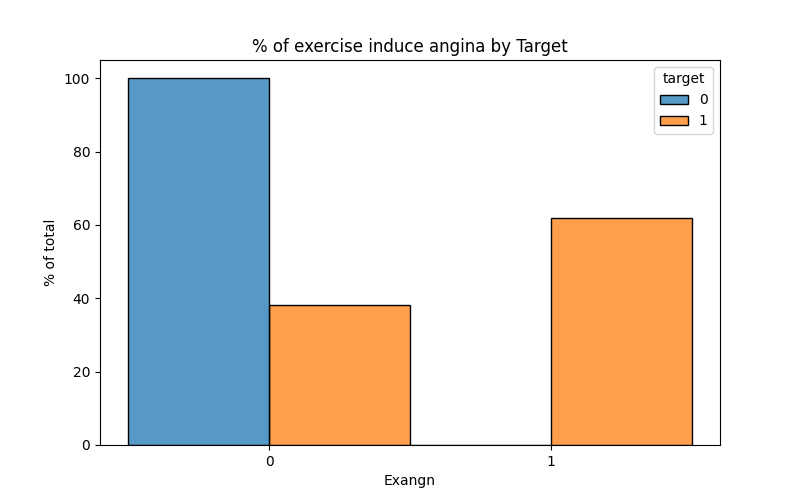
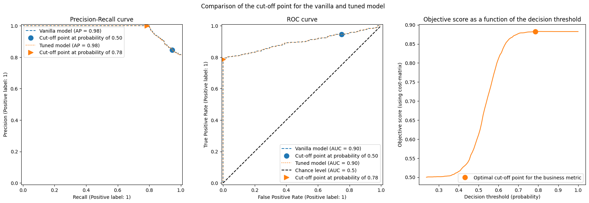

# Title: Heart Disease Prediction for the DSN AI Bootcamp

### Project Overview:
The challenge at hand revolves around the creation of a sophisticated predictive model aimed at determining the likelihood of an individual having heart disease. As one of the leading causes of global mortality, detecting heart disease in its early stages is pivotal for enhancing patient outcomes and halting its progression. The conventional diagnostic methods often come with substantial costs and time requirements. Thus, there exists a pressing need for a cutting-edge predictive model that can evaluate the risk of heart disease utilizing easily accessible patient information.

The objective of this challenge is to design and build a predictive model capable of accurately determining the probability of an individual having heart disease. The focus is on leveraging machine learning techniques to create a model that can analyze relevant features and provide reliable predictions. The model should demonstrate high accuracy and generalizability, ensuring its effectiveness on new, unseen data.

### Key Visualization from Analysis.

**INSIGHTS**

* Individuals with *Exercise induced Angina* have high chance of heart disease.
* Individuals with *chest pain (0)* have heart disease.

### Problem Statement

The objective was to develop a robust classification model that could accurately predict whether a patient has heart disease (target variable = 1) or not (target variable = 0). This is a critical task in healthcare, as early and accurate detection can significantly improve patient outcomes.
   

### MODELLING EVALUATION.

#### Logistic Regression.

    Train ROC-AUC SCORE: 0.8270800873211603
    Test ROC-AUC SCORE: 0.8376050420168069
                  precision    recall  f1-score   support
    
               0       0.54      0.84      0.66       136
               1       0.96      0.84      0.89       595
    
        accuracy                           0.84       731
       macro avg       0.75      0.84      0.78       731
    weighted avg       0.88      0.84      0.85       731
    

#### RandomForest.

    Train ROC-AUC SCORE: 0.9070821196070424
    Validation ROC-AUC SCORE: 0.598109243697479
                  precision    recall  f1-score   support
    
               0       0.52      0.25      0.34       136
               1       0.85      0.95      0.89       595
    
        accuracy                           0.82       731
       macro avg       0.68      0.60      0.62       731
    weighted avg       0.78      0.82      0.79       731
    
    tuned_model.best_threshold_=0.78
    tuned_model.best_score_=0.88

    
   

**CONCLUSION.**

The most important factors of *Heart Disease* exercise induced angina(exang), chest pain(cp), 
and maximum heart rate achieved(thalach).

**THANK YOU.**
